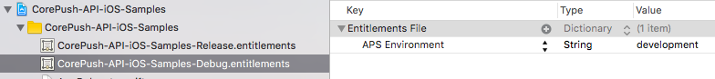
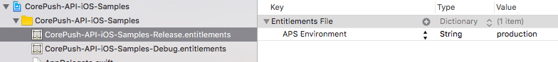

# Core Push API iOS Samples (iOS10のリッチ通知用)

###  概要
<p>CORE PUSH APIを使用したリッチ通知のサンプルプロジェクトを提供します。</p>
<p>本プロジェクトでは、以下のサンプルを提供しています。</p>
* リッチ通知用のトークン登録
  * <a href="http://developer.core-asp.com/api_token_rich.php">事前登録API</a>を使用して、iOSのデバイストークンを登録するサンプルコード
* リッチ通知用のトークン削除
  * <a href="http://developer.core-asp.com/api_token_rich.php">事前登録API</a>を使用して、iOSのデバイストークンを削除するサンプルコード

<p>各APIの詳細については、<a href="http://developer.core-asp.com/index.php">Core Push Developer Support</a>の<a href="http://developer.core-asp.com/api_token.php">CORE PUSH API</a>をご参照ください。</p>

### 前提
* Xcode8のSwift3.0を使用しています。
* iOS10.0以上で動作します。
* CORE PUSH SDKは使用していません。
* CORE PUSHの設定キーが必要になります。CORE PUSHの管理画面でアプリの設定キーをご確認できます。設定キーの設定については、「CORE PUSHの設定キーの設定」の項目をご参照ください。
* Entitlementファイルのaps-environmentにAPNSの動作環境の設定が必要です。設定方法については、ntitlementの通知設定の項目をご参照ください。
* アプリのバンドルIDに対応するプロビジョニングプロファイルの設定が必要です。

### <div id="config_key">CORE PUSHの設定キーの設定</div>

CORE PUSHの管理画面で確認したアプリの設定キーを CorePushUtilクラス内のCorePushConfigKeyの定数に指定してください。

```
struct CorePushConst {

    // 設定キー
    static let CorePushConfigKey = "＜管理画面内のアプリの設定キーの値＞"
}
```

### <div id="entitlement_setting">Entitlementの通知設定</div>

APNSの動作環境に応じて、Entitlementファイルのaps-developmentキーに以下の値を指定します。

| APNSの動作環境     | aps-environmentキーの値|
|-----------------|------------|
| サンドボックス環境  | development |  
| 本番環境           |  production | 

APNSのサンドボックス環境で動作させる場合はdevelopment、本番環境で動作させる場合はproductionの値を指定します。

本サンプルでは、Debugコンフィギュレーション用のEntitlementファイル(CorePush-API-iOS-Samples-Debug.entitlements)にdevelopmentを指定し、Releaseコンフィギュレーション用のEntitlementファイル(CorePush-API-iOS-Samples-Release)にproductionを指定しています。

##### Debugコンフィギュレーション用のEntitlementファイルの例


##### Releaseコンフィギュレーション用のEntitlementファイルの例
